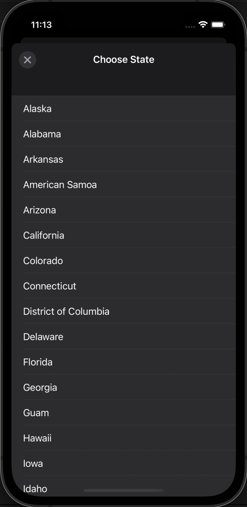

# InterCoV-19

<!-- ABOUT THE PROJECT -->
<p align="center">
  <a href="#" target="_blank"></a>
</p>

Aplikasi iOS InterCoV-19 adalah sebuah aplikasi yang menampilkan kasus harian Covid-19 di U.S dengan framework Charts (danielgindi) dan source data API dari covidtracking.com. Aplikasi ini memfilter data kasus harian berdasarkan States dan menampilkannya dalam bentuk TableView dan Grafik Batang.

## Preview
<p align="center">
    <a href="#" target="_blank"></a>
    <a href="#" target="_blank"></a>
    <a href="#" target="_blank"></a>
</p>

<!-- ABOUT THE FILE & FOLDER STRUCTURE -->
## Folder & File Structure
Berikut struktur file dan folder pada InterCoV-19:

    .
    ├── AppDelegate.swift
    ├── SceneDelegate.swift
    ├── ViewController.swift                          # Tampilan Beranda Aplikasi
    ├── APIService.swift                              # Berisikan Extension Format Tanggal, Fetch Data, dan Deklarasi Data API yang digunakan
    ├── info
    └── FilterViewController.swift                    # Tampilan Halaman dan Fungsi Filter States

## Build With:
* [Swift](https://www.swift.org/documentation/)
* [Xcode](https://developer.apple.com/xcode/)
* [Covid Tracking API](https://covidtracking.com/data/api/version-2)
* [Swift Charts by danielgindi](https://github.com/danielgindi/Charts)

<!-- How to Install -->
## Installation
Untuk menggunakan repositori ini, ikutilah petunjuk penggunaan berikut dan pastikan git sudah terinstall pada komputer (semua perintah dilaksanakan pada `cmd.exe` atau `terminal`):

1. Lakukan download .zip atau `clone` repositori dengan cara:
```bash
git clone https://github.com/dekapd99/InterCoV-19.git
```

2. Jika sudah, buka project melalui Xcode
3. Untuk menjalankan aplikasi ini, pastikan untuk menambahkan Packages dengan cara buka Project dengan Xcode > File > Add Packages dan masukkan link ini dikolom pencarian https://github.com/danielgindi/Charts dan silahkan klik next sampai selesai. Atau bisa install via Cocopods.
4. Build & Run

<!-- What Kind of License? -->
## License
No License 

<p align="right">(<a href="#top">back to top</a>)</p>
